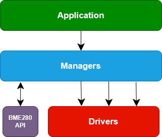
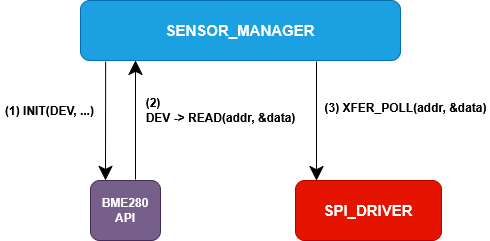
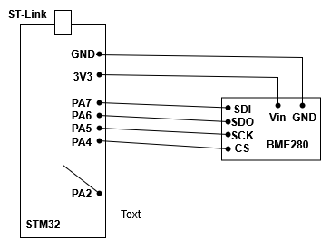

# About my Embedded Project

## Motivation

Computer systems aren’t of much use until they interact with the world. Unsurprisingly, the most obvious interactions are human–computer interactions, usually achieved by reading keystrokes and presenting information through a GUI. Increasingly, though, computers are interacting with the world more directly, by sensing and actuating. Having spent most of my time building the first kind of system, I wanted to make something more practical. And given the rapid growth of the IoT, and the attention it’s receiving, I decided to learn about embedded systems by building an IoT device.

For this project, I’ve chosen to go completely bare metal. That means no HAL libraries, avoiding stdlib functions, and using VS Code, and occasionally a plain text editor, a linker script, and a Makefile instead of STM32’s IDE. This approach forces me to really understand the hardware by reading datasheets, reference manuals, and schematics myself, rather than relying on tooling to surface that information, and to understand exactly how my code interacts with the MCU.

The eventual goal is to join The Things Network (TTN) and communicate over LoRaWAN.

## Learning by Doing

This project is also a way for me to learn low-level programming. As such, you can see that I approach things differently throughout the project. An obvious example is naming conventions:

```
void main(){
  ...
  uint8_t usart_config_retval = Manager_USART_Config(USART_MODE_POLLING);
  ...
  manager_retval = sensor_manager_init();
```

Obviously that is bad practice in general but I'm the only one looking at the project so I'm letting it slide.

## Design

I have divided my project into drivers, managers (which act as my own HAL) and application code. I have tried to make everything as self-contained as possible, my drivers are completely self contained, managers interact with many drivers and the main application interacts with many managers. The only exception is the BME280 driver which uses pointers to SPI read and write functions. This modularity has made it easier for me to diagnose issues and refactor.

<!-- 
     
<em>Figure 1: Firmware architecture for the embedded system.</em> -->

<p style="text-align: center;">
  
  <br>
  <em>Figure 1: Firmware architecture for the embedded system.</em>
</p>


## Debugging Manager

The debugging manager is simple. It configures the relevant GPIO pins and passes a buffer to the USART driver to write. My board has a bridge between USART pins and the ST-Link for easy debugging, but it also works with a UART-USB adapter.

## Sensor Manager

The sensor manager essentially configures the clocks and gpio pins for SPI transfers and the BME280 and SPI drivers. The read process is illustrated below (write is similar). It is not completely accurate -- there are intermediate steps -- but it does capture the process in general. 

The sensor manager initiates the BME280 and passes the bme280_dev struct; this struct contains pointers to the spi_read, spi_write and delay functions. 

```
struct bme280_dev
{
    ...

    /*! Read function pointer */
    bme280_read_fptr_t read;

    /*! Write function pointer */
    bme280_write_fptr_t write;

    /*! Delay function pointer */
    bme280_delay_us_fptr_t delay_us;

    ...
};
```

```
typedef BME280_INTF_RET_TYPE (*bme280_read_fptr_t)(uint8_t reg_addr, uint8_t *reg_data, uint32_t len, void *intf_ptr);

typedef BME280_INTF_RET_TYPE (*bme280_write_fptr_t)(uint8_t reg_addr, const uint8_t *reg_data, uint32_t len, void *intf_ptr);

typedef void (*bme280_delay_us_fptr_t)(uint32_t period, void *intf_ptr);
```

Polling functions are used since the stm32 wakes up every five minutes and only makes short transfers to the bme280: usually one byte (two including the address) except for burst writes or reading sensor data (usually around 8 bytes). 

The BME280 calls read/write wrappers in the sensor manager, which have the expected function signatures, and the manager then calls the corresponding driver function. The BME280 driver and SPI driver never call one another.


<p style="text-align: center;">
  
  <br>
  <em>Figure 2: Sensor-read illustration.</em>
</p>

      
## Pinout

| Signal        | MCU Pin |
|---------------|---------|
| SPI1_MOSI     | PA7     |
| SPI1_MISO     | PA6     |
| SPI1_SCK      | PA5     |
| SPI1_NSS      | PA4     |
| USART2_TX     | PA2     |


<p style="text-align: center;">
  
  <br>
  <em>Figure 3: Pinout configuration for the sensor.</em>
</p>

## Challenges

The most significant challange I faced was my complete lack of soldering experience. My first attempt was, I imagine, as bad as it gets. My first attempt at desoldering did not go much better:


