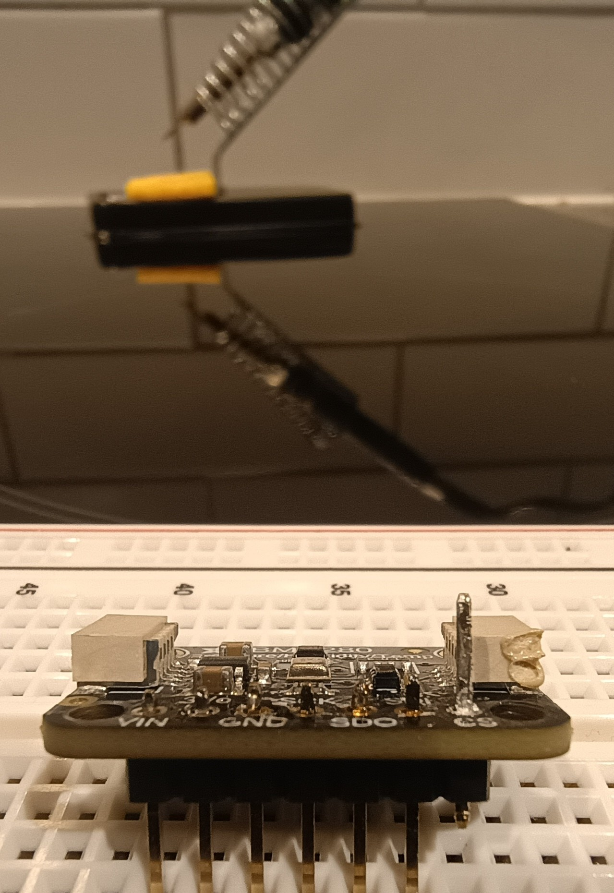

# About my Embedded Project

The following is a ramble on this project (so far). I discuss my motivations, designs, the embarrassing mistakes I made and the lessons I've learned so far. This project Is not yet complete. So far I have finished writing my serial debugging module and integrating the sensor.

## Motivation

Computer systems aren’t of much use until they interact with the world. Unsurprisingly, the most obvious interactions are human–computer interactions, usually achieved by reading keystrokes and presenting information through a GUI. Increasingly, though, computers are interacting with the world more directly, by sensing and actuating. Having spent most of my time building the first kind of system, I wanted to make something more practical. And given the rapid growth of the IoT, and the attention it’s receiving, I decided to learn about embedded systems by building an IoT device.

For this project, I’ve chosen to go completely bare metal. That means no HAL libraries, avoiding stdlib functions, and using VS Code, and occasionally a plain text editor, a linker script, and a Makefile instead of STM32’s IDE. This approach forces me to really understand the hardware by reading datasheets, reference manuals, and schematics myself, rather than relying on tooling to surface that information, and to understand exactly how my code interacts with the MCU.

The eventual goal is to join The Things Network (TTN) and communicate over LoRaWAN.

## Learning by Doing

This project is also a way for me to learn low-level programming. As such, you can see that I approach things differently throughout the project. An obvious example is naming conventions:

```
void main(){
  ...
  uint8_t usart_config_retval = Manager_USART_Config(USART_MODE_POLLING);
  ...
  manager_retval = sensor_manager_init();
```

Obviously that is bad practice in general but I'm the only one looking at the project so I'm letting it slide.

## Design

I have divided my project into drivers, managers (which act as my own HAL) and application code. I have tried to make everything as self-contained as possible, my drivers are completely self contained, managers interact with many drivers and the main application interacts with many managers. The only exception is the BME280 driver which uses pointers to SPI read and write functions. This modularity has made it easier for me to diagnose issues and refactor.

<!-- 
     
<em>Figure 1: Firmware architecture for the embedded system.</em> -->

<p style="text-align: center;">
  
  <br>
  <em>Figure 1: Firmware architecture for the embedded system.</em>
</p>


## Debugging Manager

The debugging manager is simple. It configures the relevant GPIO pins and passes a buffer to the USART driver to write. My board has a bridge between USART pins and the ST-Link for easy debugging, but it also works with a UART-USB adapter.

## Sensor Manager

The sensor manager essentially configures the clocks and gpio pins for SPI transfers and the BME280 and SPI drivers. The read process is illustrated below (write is similar). It is not completely accurate -- there are intermediate steps -- but it does capture the process in general. 

The sensor manager initiates the BME280 and passes the bme280_dev struct; this struct contains pointers to the spi_read, spi_write and delay functions. 

```
### THIS IS BOSCH's CODE - NOT MINE

struct bme280_dev
{
    ...

    /*! Read function pointer */
    bme280_read_fptr_t read;

    /*! Write function pointer */
    bme280_write_fptr_t write;

    /*! Delay function pointer */
    bme280_delay_us_fptr_t delay_us;

    ...
};
```

```
typedef BME280_INTF_RET_TYPE (*bme280_read_fptr_t)(uint8_t reg_addr, uint8_t *reg_data, uint32_t len, void *intf_ptr);

typedef BME280_INTF_RET_TYPE (*bme280_write_fptr_t)(uint8_t reg_addr, const uint8_t *reg_data, uint32_t len, void *intf_ptr);

typedef void (*bme280_delay_us_fptr_t)(uint32_t period, void *intf_ptr);
```

Polling functions are used since the stm32 wakes up every five minutes and only makes short transfers to the BME280: usually one byte (two including the address) except for burst writes or reading sensor data (usually around 8 bytes). 

The BME280 calls read/write wrappers in the sensor manager, which have the expected function signatures, and the manager then calls the corresponding driver function. The BME280 driver and SPI driver never call one another.


<p style="text-align: center;">
  
  <br>
  <em>Figure 2: Sensor-read illustration.</em>
</p>

      
## Pinout

| Signal        | MCU Pin |
|---------------|---------|
| SPI1_MOSI     | PA7     |
| SPI1_MISO     | PA6     |
| SPI1_SCK      | PA5     |
| SPI1_NSS      | PA4     |
| USART2_TX     | PA2     |


<p style="text-align: center;">
  
  <br>
  <em>Figure 3: Pinout configuration for the sensor.</em>
</p>

## Challenges

The most significant challenge I faced was my complete lack of soldering experience. My first attempt was, I imagine, as bad as it gets. My first attempt at desoldering did not go much better:

<p style="text-align: center;">
  
  <br>
  <em>Figure 4: Sensor after desoldering.</em>
</p>

I ended up using pliers to take the rubber protector off, heating up the solder on the pin that was sticking out and using pliers again to pull the pin out. Residiual solder in the connection prevented me from putting a spare pin in, so I used a copper wick to clean it out. That was risky, given the sensitive components on the sensor. I put the new pin in and resoldered.

Debugging the sensor manager and drivers was difficult. I decided to write the firmware before I had managed to resolder the sensor which meant I wasn't testing as I programmed. In hindsight I could've made some unit tests that simulated sensor reads since I ended up using polling functions and that would have helped identify a number of problems.

By the time the sensor was soldered in I had a lot of code to test. I was reading reset values from the sensor data registers:

```
(gdb) x/8bx reg_data
0x2000bf40      0x80 0x00 0x00 0x80 0x00 0x00 0x80 0x80
```

There were a number of small issues and I ended up making lots of revisions. 

This was how I originally wrote to, and read from, the data register:

```
spi_line->DR = tx_char_buffer[i];
rx_char_buffer[i] = spi_line->DR;
```

Since the data register is 32-bits I was performing a 32-bit access. That didn't click for me until disassembling the spi_transfer_polling function. Here is the assembly for `spi_line->DR = char_buffer[i]`:

```
ldr  r2, [r7, #12]   @ Load the data pointer into r2
ldr  r3, [r7, #36]   @ Load the index into r3
add  r3, r2          @ Address of the byte to write
ldrb r3, [r3, #0]    @ Load the byte
mov  r2, r3          @ Move the byte into r2

ldr  r3, [r7, #4]    @ Load the spi peripheral address (0X40013000)
str  r2, [r3, #12]   @ Store the byte in the DR (0X4001300C)
```

The significant instruction of that being the `str  r2, [r3, #12]` which is a 32-bit access. So I cast the pointer to the data register so that it forced an 8-bit access `strb  r2, [r3, #0]`:

```
*(volatile uint8_t *)&spi_line->DR = tx_char_buffer[i];
rx_char_buffer[i] = *(volatile uint8_t *)&spi_line->DR;
```

This wouldn't explain why I was reading reset values though, It just enforced byte accesses. The fact that I was reading reset values instead of sensor data meant something had gone wrong in the configuration. I was fairly certain that the problem was with my write function and not the BME280 API so I wired MOSI to MISO on my MCU and stepped through every call to the write function. 

Eventually it was called to write to the 0x00 register in the BME280. That wasn't on the memory map so I traced backwards to this function in Bosch's API:

```
static int8_t set_osr_press_temp_settings(...)
{
    int8_t rslt;
    uint8_t reg_addr = BME280_REG_CTRL_MEAS;
    uint8_t reg_data;

    rslt = bme280_get_regs(reg_addr, &reg_data, 1, dev);

    if (rslt == BME280_OK)
    {
        ...

        /* Write the oversampling settings in the register */
        rslt = bme280_set_regs(&reg_addr, &reg_data, 1, dev);
```

Stepping through the function it became clear that after calling `bme280_get_regs(reg_addr, &reg_data, 1, dev)` the address was being overwritten to 0x00. This function called my spi_read wrapper in the sensor manager and, taking a look at that makes the problem obvious:

```
static int8_t user_spi_read_blocking(uint8_t reg_addr, uint8_t* reg_data, uint32_t len, void* intf_ptr){
  ...
  uint8_t retval = spi_transfer_polling(spi_line, tx_buffer, reg_data, len+1, 8U);
  ...
  mymemmove(reg_data, &reg_data[1], len);
  ...
```

My horrible solution to dealing with dummy bytes was to read the bytes into `reg_data` which pointed to the `uint8_t reg_data` variable in `set_osr_press_temp_settings` and use `mymemmove` to copy the actual data into the reg_data variable. But, that meant I was reading the dummy byte and the actual byte into reg_data which pointed to a single byte. So I did what I should've done in the first place and handled dummy bytes using a seperate variable in the spi driver.

## Lessons Learned

Test as you go. Its so much easier. Heat the soldering iron up enough and use lots of flux. Carefully read the datasheets and reference manuals for every device in the embeded system. Don't do things like write two bytes to a char.

## Moving Forward

Next steps are to use docker for my CI/CD pipeline. I have setup some docker but not yet integrated it into github actions. I will also begin integrating comms (soldering first this time) although that will have to take a backseat to my dissertation work [Learn More](dissertation). 


